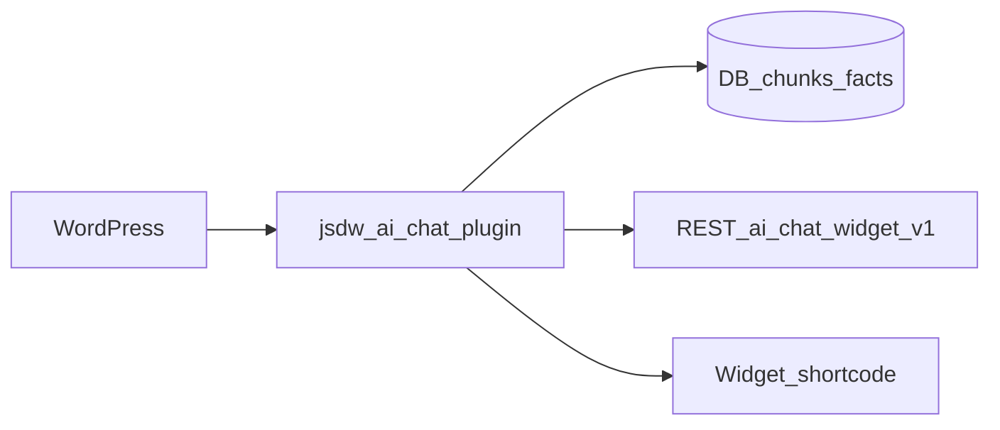

# JSDW AI Chat

[](https://wordpress.org/)
[](https://www.php.net/)
[](https://www.gnu.org/licenses/gpl-2.0.html)

**Local-first site knowledge assistant** for WordPress: index your content, answer from your own index, expose a **REST API**, and embed a **front-end chat widget**. Optional **AI phrase assist** (OpenAI, when configured) can refine wording of high-confidence local answers only—it does not replace retrieval or invent facts.

Current release line: **1.1.0** (see [`jsdw-ai-chat/jsdw-ai-chat.php`](jsdw-ai-chat/jsdw-ai-chat.php) for the authoritative version).

---

## Screenshots

Add images under `docs/screenshots/` and link them here, for example:

- `docs/screenshots/dashboard.png` — admin dashboard  
- `docs/screenshots/design-studio.png` — Design Studio  
- `docs/screenshots/widget.png` — front-end widget  

Pull requests that add screenshots are welcome.

---

## Features

| Area | What you get |
|------|----------------|
| **Sources & indexing** | Discover and index WordPress content into chunks and facts; background jobs and cron keep the index fresh. Admin: **Sources**, **Jobs & Logs**. |
| **Answers** | Retrieval and scoring are local-first; canned copy and fallbacks are configurable (answer style, canned responses). |
| **REST API** | Routes live under namespace `ai-chat-widget/v1` (see [`jsdw-ai-chat/includes/class-rest.php`](jsdw-ai-chat/includes/class-rest.php)). `/health` is readable without auth. **Chat** routes use `chat_query_permission`: users with `manage_ai_chat_widget` are always allowed; otherwise the public query setting must be on **and** a valid `wp_rest` REST nonce must be present. Conversation and most admin routes require their respective capabilities. |
| **Widget** | Front-end shortcode: `[jsdw_ai_chat_widget]` — registered in [`jsdw-ai-chat/public/class-widget-renderer.php`](jsdw-ai-chat/public/class-widget-renderer.php). |
| **Design Studio** | Tune layout, triggers, and widget chrome in admin. The in-admin **preview is simulated**—always verify on a real page after saving ([`SYSTEMS_CHECK.md`](SYSTEMS_CHECK.md)). |
| **Conversations** | Optional stored conversations and agent tooling are gated by settings (`privacy.store_conversations`, `features.enable_chat_storage`). For agent handoff: use **Join conversation** before **Send** ([`SYSTEMS_CHECK.md`](SYSTEMS_CHECK.md)). |
| **AI providers** | OpenAI, Anthropic, and Google integrations exist in code. **Phrase assist** is implemented for **OpenAI** when enabled and keyed; other providers are not used for phrase assist today ([`SYSTEMS_CHECK.md`](SYSTEMS_CHECK.md)). |

---

## Requirements

| Requirement | Version |
|-------------|---------|
| WordPress | ≥ 6.0 |
| PHP | ≥ 8.0 |

---

## Installation

1. Copy the **`jsdw-ai-chat`** folder into `wp-content/plugins/`, **or** use **Plugins → Add New → Upload Plugin** with a distribution zip.
2. Activate **JSDW AI Chat** under **Plugins**.
3. Open the **JSDW AI Chat** menu in wp-admin to configure sources, settings, and the widget.

### Build a release zip (from this repo)

Packaged zips are written to `dist/` (that directory is **gitignored**; generate it locally):

```bash
bash scripts/package-plugin.sh
```

Output: `dist/jsdw-ai-chat-<Version>.zip` where `<Version>` comes from the plugin header (currently `1.1.0`). Dev-only files at the plugin root (`*.md`, `PHASE*`, etc.) are excluded from the zip per the script.

---

## Quick configuration

1. **Sources** — Ensure important content types are enabled and indexing completes; check **Jobs & Logs** for failures.
2. **Public widget** — If visitors should query from the front end, enable the public query endpoint in Settings (`chat.allow_public_query_endpoint`); otherwise the widget may report that the public endpoint is disabled ([`SYSTEMS_CHECK.md`](SYSTEMS_CHECK.md)).
3. **AI / phrase assist** — Optional: configure a provider and enable phrase assist only if you want OpenAI to polish wording under the plugin’s gates ([`jsdw-ai-chat/readme.txt`](jsdw-ai-chat/readme.txt)).

For capability names (who can open Settings, Sources, Conversations, etc.), see [`SYSTEMS_CHECK.md`](SYSTEMS_CHECK.md).

---

## Architecture (high level)



---

## Repository layout (contributors)

- **All plugin code** lives under [`jsdw-ai-chat/`](jsdw-ai-chat/). WordPress should load **`jsdw-ai-chat/jsdw-ai-chat.php`** only—do not point `wp-content/plugins` at the repository root.
- Phase deliverables and static previews live under [`docs/archive/from-docs-html/`](docs/archive/from-docs-html/) (not loaded by WordPress). [`docs/archive/SOURCES_ADMIN_AUDIT.txt`](docs/archive/SOURCES_ADMIN_AUDIT.txt) is an internal sources-page audit note. Operational reference: [`SYSTEMS_CHECK.md`](SYSTEMS_CHECK.md).

---

## Privacy and external APIs

Retrieval and answers are **local-first**: they are built from your indexed site content. External APIs are used **only** when AI-related features are enabled, a provider is configured, and (for phrase assist) the relevant settings and gates allow it—still only for constrained refinement of answer text, not for replacing your index ([`jsdw-ai-chat/readme.txt`](jsdw-ai-chat/readme.txt)).

---

## Further reading

- [`SYSTEMS_CHECK.md`](SYSTEMS_CHECK.md) — deploy path, settings gates, capabilities, indexing, preview vs production, agent handoff.
- [`jsdw-ai-chat/readme.txt`](jsdw-ai-chat/readme.txt) — WordPress.org–style readme and changelog.

---

## License

GPLv2 or later — see [`jsdw-ai-chat/readme.txt`](jsdw-ai-chat/readme.txt).
