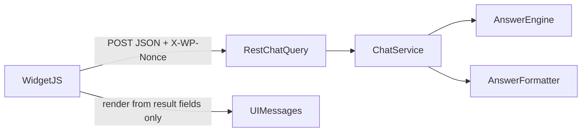

# Phase 6 deliverable — Widget UI and front-end integration

## 1. Files created or modified

**Created**

- `public/class-widget-renderer.php` — enqueue, localize, shortcode `[jsdw_ai_chat_widget]`, optional footer mount.
- `public/js/widget.js` — vanilla widget controller (chat + REST).
- `public/css/widget.css` — widget styles (moved from flat `public/widget.css`).

**Modified**

- `public/class-public.php` — delegates asset loading to `JSDW_AI_Chat_Widget_Renderer`.
- `includes/class-settings.php` — `widget_ui` defaults, merge in `get_all()`, `sanitize_widget_ui()`.
- `includes/class-plugin.php` — constructs renderer, calls `register_hooks()`, injects renderer into `JSDW_AI_Chat_Public`.
- `jsdw-ai-chat.php` — `require_once` for `class-widget-renderer.php` before `class-public.php`.
- `admin/js/design-studio.js` — comments updated to reference `public/js/widget.js`.

**Removed**

- `public/widget.js`, `public/widget.css` (replaced by `public/js/` and `public/css/`).

**Mirror**

- Same paths under `jsdw-ai-chat/` (including deleted flat widget assets).

## 2. Widget settings keys (`widget_ui`)

| Key | Purpose |
| --- | --- |
| `widget_enabled` | Master switch for Phase 6 widget output (with `general.enabled` + `features.enable_widget`). |
| `widget_position` | `''` or `bottom-right` / `bottom-left` / `top-right` / `top-left`. Empty falls back to `widget_design.position`. |
| `launcher_label` | Optional text on the launcher button. |
| `welcome_message` | Overrides design welcome when non-empty. |
| `placeholder_text` | Overrides design input placeholder when non-empty. |
| `show_sources` | When the formatter payload includes `sources` (typically admin debug endpoint), render a source list. |
| `allow_reset_conversation` | Show reset control; clears `localStorage` session keys and on-screen messages. |
| `admin_debug_ui` | When combined with `manage_ai_chat_widget`, use `POST /chat/query-debug` and show a small debug panel (limited fields). |
| `auto_footer` | When true, inject a mount `
` in `wp_footer` if the shortcode was not used. |

## 3. Shortcode and footer injection

- **Shortcode:** `[jsdw_ai_chat_widget]` outputs the mount div when the widget is allowed to run; otherwise an empty string.
- **Footer:** If `auto_footer` is true, no shortcode ran on the request, and `should_output_mount()` is true, the same mount markup is echoed in `wp_footer` (priority 20).
- **Public endpoint off:** Non-admin users get no mount, no assets, no enqueue. Admins with `manage_ai_chat_widget` may still see assets and a disabled/testing UI (`runtimeMode: admin_disabled`) when the public endpoint is off.

## 4. Localized script object (`JSDW_AI_CHAT_WIDGET`)

Key fields include: `widgetDesign` / `design`, `widgetUi`, `restUrl`, `restUrlDebug`, `nonce`, `runtimeMode`, `allowPublicQuery`, `isAdminCapable`, `adminDebugUi`, `useDebugEndpoint`, `showSources`, `allowReset`, `launcherLabel`, `welcomeMessage`, `placeholderText`, `widgetPosition`, `currentPostId`, `isLoggedIn`, `branding`, `debug`, `strings` (localized UI copy).

## 5. Request/response flow

- Admin debug path uses `POST /chat/query-debug` when `useDebugEndpoint` is true (same body shape, `data` includes `conversation` + `result`).

## 6. Session handling

- `localStorage`: `jsdw_ai_chat_w_sk` (session key), `jsdw_ai_chat_w_cid` (conversation id).
- Requests send `session_key` and `conversation_id`; responses update storage from `data.conversation.session_key` and `data.conversation.id`.
- Reset clears both keys and removes non-welcome messages.

## 7. Clarification / fallback UI (field-driven)

- Assistant copy uses `clarification_question` when `answer_status === 'requires_clarification'` and that field is non-empty; otherwise `answer_text`.
- No inference from raw text alone for clarification vs. other modes.
- `data-answer-status` on bubbles supports styling; errors use a dedicated error bubble for transport failures.

## 8. Admin debug behavior

- When `admin_debug_ui` and `manage_ai_chat_widget` are true, requests go to `restUrlDebug` and a compact debug panel shows `answer_status`, `answer_type`, `confidence`, and optional `retrieval_stats` fields (no full trace dump).
- `show_sources` only lists `result.sources` when present in the payload.

## 9. Accessibility

- Dialog `role` and `aria-label` on the panel; launcher, send, reset, and close with `aria-label` (localized strings).
- Message region `role="log"` with `aria-live="polite"`; loading state sets `aria-busy` on the input.
- `focus-visible` outlines on interactive controls.

## 10. Verification checklist

- [ ] `php -l` on changed PHP files passes.
- [ ] Public + `allow_public_query_endpoint` false: no widget assets, no REST calls, no broken shell.
- [ ] Admin + endpoint off: optional disabled message, no fetch.
- [ ] Public + endpoint on: send message, receive assistant reply from structured `result` fields.
- [ ] `answer_status` paths (including clarification and guard) render without guessing from free text.
- [ ] Session persists across reloads; reset clears storage and UI.
- [ ] Shortcode-only vs footer auto-inject: no duplicate mounts.
